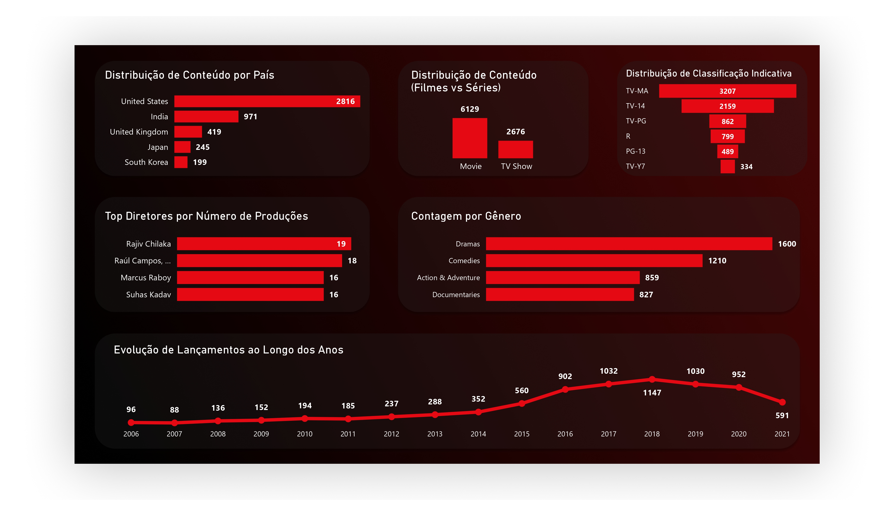

# Projeto SQL – Análise de Plataforma de Streaming (Netflix)

## Resumo do Projeto
Análise de catálogo da Netflix utilizando SQL para exploração de dados e Power BI para visualização estratégica.

## Objetivo do Projeto
Este projeto realiza uma análise exploratória dos dados da Netflix, utilizando **SQL** para extração e tratamento dos dados, e **Power BI + Figma** para a comunicação visual dos insights.

O objetivo é simular um cenário real de BI, onde dados brutos são transformados em informações estratégicas para apoiar a tomada de decisão.

---

## Estrutura do Projeto

```05-projeto-sql/
│
├── dados/              # Base CSV original (Raw Data)
├── dashboard/          # Arquivo .pbix do Power BI
├── imagens/           # Prints e assets do dashboard
├── scripts/           # Queries SQL organizadas por etapas
│   ├── etapa_1.sql     # Exploração e limpeza
│   ├── etapa_2.sql     # Rankings e análises intermediárias
│   └── etapa_3.sql     # Window Functions e análises avançadas
│
└── README.md
```

---

## Modelagem do Banco de Dados

```sql
CREATE TABLE netflix_titles (
    show_id VARCHAR(10) PRIMARY KEY,
    type VARCHAR(20),
    title VARCHAR(255),
    director VARCHAR(255),
    cast TEXT,
    country VARCHAR(100),
    date_added DATE,
    release_year INT,
    rating VARCHAR(10),
    duration VARCHAR(50),
    listed_in VARCHAR(255),
    description TEXT
); 

```

---

# Etapas do Desenvolvimento

## Etapa 1 – Exploração e Limpeza
**Foco na estruturação do ambiente e tratamento de dados.**

* **Tratamento de Nulos:** Uso de `COALESCE(director, 'Não Informado')` para garantir a integridade visual dos relatórios.
* **Volumetria:** Análise da proporção entre **Filmes vs. Séries**.
* **Padronização:** Entendimento inicial dos tipos de dados e correção de inconsistências.

---

## Etapa 2 – Análises Intermediárias
**Criação de rankings para entender o comportamento do catálogo:**

* **Rankings Geográficos:** Produções organizadas por país de origem.
* **Classificação Indicativa:** Distribuição do catálogo por *Rating* (faixa etária).
* **Linha do Tempo:** Evolução histórica das adições ao catálogo ao longo dos anos.

---

## Etapa 3 – Análises Avançadas
**Utilização de Window Functions para análises mais profundas:**

* **DENSE_RANK():** Criação de rankings de títulos mais frequentes por país, sem pular posições em caso de empates.
* **PARTITION BY:** Segmentação de cálculos por tipo de conteúdo (*Movie* ou *TV Show*).
* **Granularidade:** Comparações internas dentro de grupos específicos sem a necessidade de reduzir as linhas do dataset original.


# Exemplo de Query

```SELECT 
    director, 
    listed_in AS genero, 
    COUNT(*) AS total,
    DENSE_RANK() OVER (
        PARTITION BY listed_in 
        ORDER BY COUNT(*) DESC
    ) AS ranking
FROM netflix_titles
WHERE director IS NOT NULL
GROUP BY director, listed_in;
```
# Dashboard Estratégico

O design foi desenvolvido no **Figma** com o conceito **Dark Mode (Cinematographic Black)**, reforçando a identidade visual da marca e aumentando a imersão do usuário.

---

## Principais Insights
* **Concentração de Mercado:** Estados Unidos e Índia dominam grande parte do catálogo global.
* **Evolução Histórica:** Pico de adições entre 2017 e 2019.
* **Preferência de Formato:** Filmes representam a maior parte do catálogo.

---

## Insights Estratégicos

### Predominância de Conteúdo
O catálogo é majoritariamente composto por **Filmes**, indicando um forte histórico de licenciamento de cinema.

### Concentração Geográfica
**Estados Unidos e Índia** lideram a produção de conteúdo, reforçando a influência global de Hollywood e Bollywood.

### Pico de Crescimento
O ano de **2018** representa o maior volume de adições ao catálogo, seguido de uma estabilização estratégica após 2019.

### Segmentação de Público
A classificação **TV-MA** é a mais frequente, indicando um foco claro no público adulto e jovem adulto.

### Gêneros Mais Frequentes
1. Dramas
2. Comédias
3. Documentários

### Diretores em Destaque
Diretores como **Rajiv Chilaka** apresentam alto volume de produção em nichos específicos, especialmente em conteúdo infantil e animação.

---

## Tecnologias Utilizadas

* **MySQL:** Extração e tratamento de dados.
* **SQL:** Queries analíticas e manipulação de dados.
* **Window Functions:** Uso de `DENSE_RANK` e `PARTITION BY`.
* **Power BI:** Criação de dashboards e visualização de dados.
* **Figma:** Design da interface e layout do dashboard.
* **Excel:** Suporte e validação de dados.

## Conclusão
Este projeto demonstra habilidades em análise de dados, SQL avançado e construção de dashboards, simulando um cenário real de Business Intelligence.

## Visualizações dos Insights
Os dados extraídos via SQL foram levados ao Power BI (com suporte de Figma para o Design) para a criação de um Dashboard estratégico.




#### Projeto acadêmico / de portfólio utilizando dados públicos da Netflix.